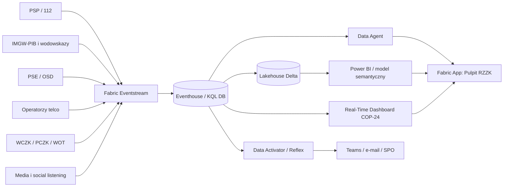

# 🏗️ Architektura COP-24

> ⚠️ Demo syntetyczne. Architektura pokazuje wzorzec wspólnego obrazu sytuacji dla RCB/RZZK, a nie produkcyjny system państwowy.

## Warstwa 1 — źródła

Źródła reprezentują PSP/112, IMGW-PIB, PGW Wody Polskie, PSE/OSD, operatorów telco, WCZK/PCZK, WOT i media. W danych demo jest 449400 odczytów hydro, 118940 obserwacji pogody, 1714 incydentów, 541 zdarzeń energetycznych i 351 zdarzeń telekomunikacyjnych. Każdy rekord ma `timestamp`, `stream` i klucz obszaru lub obiektu.

## Warstwa 2 — Eventstream

Eventstream jest bramą czasu rzeczywistego. Przyjmuje JSON z `simulate_realtime.py`, może działać przez custom endpoint albo Event Hub i rozdziela dane do Eventhouse. Latencja demonstracyjna zależy od `--speed`; produkcyjnie należy zakładać sekundy–minuty, zależnie od źródła.

## Warstwa 3 — Eventhouse / KQL

Eventhouse jest wybrany dla telemetrii, bo zapewnia szybkie ingestowanie, okna czasowe, `make-series`, `series_decompose_anomalies`, joiny czasowo-przestrzenne i dashboard real-time. Lakehouse jest lepszy dla wymiarów i trwałych wyników, ale nie powinien być pierwszą warstwą dla wysokoczęstotliwościowych odczytów co 5 minut z 120 wodowskazów.

## Warstwa 4 — Lakehouse

Lakehouse utrzymuje wymiary: 16 województw, 380 powiatów, 2477 gmin, 20 zagrożeń KPZK i 16 SPO. Tu trafiają też wyniki KIS i rekomendacje eskalacji z notebooków. To warstwa odtwarzalna i audytowalna.

## Warstwa 5 — analityka

Notebooki liczą KIS 0–100 z komponentów hydro, incydenty, energia, telekom, ewakuacja i siły/środki. Normalizacja składowych jest skalibrowana na faktycznym rozkładzie danych scenariusza (`notebooks/_calibrate.py`) tak, aby kulminacja punktowo przebijała próg 85 = zwołanie RZZK. Wyniki dzienne zapisano w `datasets/derived`: KIS krajowy rośnie od 2.0 do 3.4 w szczycie, a maksymalny lokalny KIS osiąga 86,3 w dobie kulminacji 2026-09-17.

KIS krajowy jest średnią z 2477 gmin, więc pozostaje niski nawet w kulminacji — to celowe. Zdarzenie jest lokalne, dlatego w narracji używa się `max_local_kis` i liczby gmin powyżej progów, a nie średniej krajowej.

## Warstwa 6 — semantyka i prezentacja

Model semantyczny Power BI daje język decyzyjny: KIS, gminy w alarmie, ewakuowani, odbiorcy bez prądu, czas reakcji. Real-Time Dashboard daje widok operacyjny, a Fabric App zamienia rekomendację w decyzję i wpis audytowy.

## Warstwa 7 — akcja

Activator obserwuje progi i wysyła powiadomienia. Reguły nie są „sztuczną inteligencją zastępującą człowieka”; są mechanizmem standaryzacji reakcji. Data Agent odpowiada językiem naturalnym, ale ma obowiązek cytować liczby i mówić, kiedy danych brakuje.

## Wolumeny, skalowanie, retencja

W demo wolumen jest umiarkowany: łącznie setki tysięcy rekordów, w tym największy strumień hydro. Produkcyjnie skalowanie odbywa się przez partycjonowanie po czasie i obiekcie (`gauge_id`, `gmina_code`), osobne polityki retencji dla raw i agregatów oraz rozdzielenie zapytań dashboardowych od historycznych analiz. Retencja raw może być krótka, agregaty i decyzje powinny mieć retencję zgodną z wymaganiami prawnymi.

## Co byłoby inaczej w prawdziwym wdrożeniu

- Integracje nie byłyby plikami JSONL, lecz API, kolejkami, brokerami, replikami baz lub bezpieczną wymianą międzyinstytucjonalną.
- Dane IMGW/PSE/PSP/112 miałyby właścicieli, SLA, klasyfikację i procedury korekty.
- Bezpieczeństwo wymagałoby sieci prywatnych, Managed Identity, RBAC, Purview, DLP, Key Vault i pełnego logowania dostępu.
- Informacje wrażliwe i niejawne wymagałyby osobnych środowisk i polityk etykietowania.
- Ciągłość działania wymagałaby DR, runbooków, testów odtworzeniowych i trybu pracy zdegradowanej.
- Retencja musiałaby rozróżniać telemetrię, meldunki, dane osobowe, decyzje i materiały dowodowe.

## 🔄 Przepływ danych krok po kroku

1. Symulator czyta JSONL w kolejności czasu zdarzenia i wysyła rekordy do Eventstream. W `--dry-run` ten sam rekord jest wypisywany na stdout, więc można testować bez poświadczeń.
2. Eventstream przekazuje rekord do właściwej tabeli Eventhouse. Mapowanie JSON jest płaskie i zgodne z nazwami kolumn, aby minimalizować transformacje na wejściu.
3. Materialized views utrzymują widoki `latest` i agregacje 15-minutowe. Dzięki temu dashboard nie musi liczyć wszystkiego od zera przy każdym odświeżeniu.
4. Notebooki przenoszą logikę decyzyjną do warstwy odtwarzalnej: KIS, dzienne przebiegi i rekomendacje można zapisać, porównać i audytować.
5. Power BI i Fabric App korzystają z tych samych nazw metryk, co Data Agent. To ogranicza ryzyko, że różne zespoły mówią różnymi definicjami.

## 🧮 Latencje logiczne

Hydro i telekom są najbliżej czasu rzeczywistego; incydenty i ewakuacje mogą mieć opóźnienia organizacyjne; decyzje RZZK są zdarzeniami audytowymi i nie powinny być nadpisywane. W produkcji każdy rekord powinien mieć zarówno `event_time`, jak i `ingest_time`, aby odróżnić opóźnienie źródła od opóźnienia platformy.
