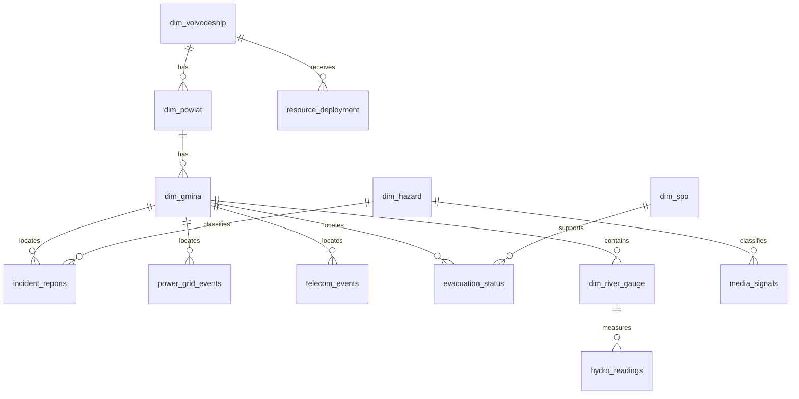

# 🧭 Model danych COP-24

> ⚠️ Wszystkie dane są syntetyczne (`seed=42`), UTF-8, daty ISO-8601 z offsetem `+02:00`. Nazwy techniczne są po angielsku i bez polskich znaków.

## Diagram relacji



## Tabele wymiarowe

### `dim_voivodeship.csv`

**Opis:** Województwa z kodem TERYT, populacją i siedzibą WCZK.

**Ziarno:** jeden rekord na obiekt wymiaru. **Liczba rekordów:** 16.

| Kolumna | Typ | Opis | Przykład | Wartości dopuszczalne |
|---|---|---|---|---|
| `voivodeship_code` | `int` | voivodeship code | `02` | zgodne z generatorem seed=42 |
| `voivodeship_name` | `string` | voivodeship name | `dolnośląskie` | zgodne z generatorem seed=42 |
| `population` | `int` | population | `2892000` | zgodne z generatorem seed=42 |
| `wczk_seat` | `string` | wczk seat | `Wrocław` | zgodne z generatorem seed=42 |
| `lat` | `string` | lat | `51.1079` | zgodne z generatorem seed=42 |
| `lon` | `string` | lon | `17.0385` | zgodne z generatorem seed=42 |

**Przykładowy rekord:**

```csv
voivodeship_code,voivodeship_name,population,wczk_seat,lat,lon
02,dolnośląskie,2892000,Wrocław,51.1079,17.0385
```

### `dim_powiat.csv`

**Opis:** Powiaty syntetyczne powiązane z województwem.

**Ziarno:** jeden rekord na obiekt wymiaru. **Liczba rekordów:** 380.

| Kolumna | Typ | Opis | Przykład | Wartości dopuszczalne |
|---|---|---|---|---|
| `powiat_code` | `int` | powiat code | `0201` | zgodne z generatorem seed=42 |
| `powiat_name` | `string` | powiat name | `kłodzki` | zgodne z generatorem seed=42 |
| `voivodeship_code` | `int` | voivodeship code | `02` | zgodne z generatorem seed=42 |
| `population` | `int` | population | `92644` | zgodne z generatorem seed=42 |
| `area_km2` | `string` | area km2 | `1980.7` | zgodne z generatorem seed=42 |
| `lat` | `string` | lat | `51.31704` | zgodne z generatorem seed=42 |
| `lon` | `string` | lon | `16.32602` | zgodne z generatorem seed=42 |

**Przykładowy rekord:**

```csv
powiat_code,powiat_name,voivodeship_code,population,area_km2,lat,lon
0201,kłodzki,02,92644,1980.7,51.31704,16.32602
```

### `dim_gmina.csv`

**Opis:** Gminy syntetyczne powiązane z powiatem i typem administracyjnym.

**Ziarno:** jeden rekord na obiekt wymiaru. **Liczba rekordów:** 2477.

| Kolumna | Typ | Opis | Przykład | Wartości dopuszczalne |
|---|---|---|---|---|
| `gmina_code` | `int` | gmina code | `0201001` | zgodne z generatorem seed=42 |
| `gmina_name` | `string` | gmina name | `Kłodzko` | zgodne z generatorem seed=42 |
| `powiat_code` | `int` | powiat code | `0201` | zgodne z generatorem seed=42 |
| `gmina_type` | `string` | gmina type | `miejska` | zgodne z generatorem seed=42 |
| `population` | `int` | population | `12418` | zgodne z generatorem seed=42 |
| `lat` | `string` | lat | `51.2269` | zgodne z generatorem seed=42 |
| `lon` | `string` | lon | `16.18686` | zgodne z generatorem seed=42 |

**Przykładowy rekord:**

```csv
gmina_code,gmina_name,powiat_code,gmina_type,population,lat,lon
0201001,Kłodzko,0201,miejska,12418,51.2269,16.18686
```

### `dim_hazard.csv`

**Opis:** Kanoniczne 20 zagrożeń KPZK Z01–Z20.

**Ziarno:** jeden rekord na obiekt wymiaru. **Liczba rekordów:** 20.

| Kolumna | Typ | Opis | Przykład | Wartości dopuszczalne |
|---|---|---|---|---|
| `hazard_code` | `string` | hazard code | `Z01` | zgodne z generatorem seed=42 |
| `hazard_name` | `string` | hazard name | `Epidemia` | zgodne z generatorem seed=42 |
| `lead_minister` | `string` | lead minister | `Minister Zdrowia` | zgodne z generatorem seed=42 |
| `cooperating_ministers` | `string` | cooperating ministers | `MSWiA; MON; wojewodowie` | zgodne z generatorem seed=42 |

**Przykładowy rekord:**

```csv
hazard_code,hazard_name,lead_minister,cooperating_ministers
Z01,Epidemia,Minister Zdrowia,MSWiA; MON; wojewodowie
```

### `dim_institution.csv`

**Opis:** Instytucje raportujące na poziomie krajowym, wojewódzkim i powiatowym.

**Ziarno:** jeden rekord na obiekt wymiaru. **Liczba rekordów:** 422.

| Kolumna | Typ | Opis | Przykład | Wartości dopuszczalne |
|---|---|---|---|---|
| `institution_id` | `string` | institution id | `INST-001` | zgodne z generatorem seed=42 |
| `institution_code` | `string` | institution code | `RCB` | zgodne z generatorem seed=42 |
| `institution_name` | `string` | institution name | `Rządowe Centrum Bezpieczeństwa` | zgodne z generatorem seed=42 |
| `level` | `string` | level | `krajowy` | zgodne z generatorem seed=42 |
| `seat` | `string` | seat | `Warszawa` | zgodne z generatorem seed=42 |

**Przykładowy rekord:**

```csv
institution_id,institution_code,institution_name,level,seat
INST-001,RCB,Rządowe Centrum Bezpieczeństwa,krajowy,Warszawa
```

### `dim_spo.csv`

**Opis:** 16 Standardowych Procedur Operacyjnych.

**Ziarno:** jeden rekord na obiekt wymiaru. **Liczba rekordów:** 16.

| Kolumna | Typ | Opis | Przykład | Wartości dopuszczalne |
|---|---|---|---|---|
| `spo_code` | `string` | spo code | `SPO-1` | zgodne z generatorem seed=42 |
| `spo_name` | `string` | spo name | `Organizacja posiedzenia Rządowego Zespołu Zarządzania Kryzysowego` | zgodne z generatorem seed=42 |

**Przykładowy rekord:**

```csv
spo_code,spo_name
SPO-1,Organizacja posiedzenia Rządowego Zespołu Zarządzania Kryzysowego
```

### `dim_river_gauge.csv`

**Opis:** Wodowskazy z progami ostrzegawczymi/alarmowymi i opóźnieniem fali.

**Ziarno:** jeden rekord na obiekt wymiaru. **Liczba rekordów:** 120.

| Kolumna | Typ | Opis | Przykład | Wartości dopuszczalne |
|---|---|---|---|---|
| `gauge_id` | `string` | gauge id | `WG-001` | zgodne z generatorem seed=42 |
| `gauge_name` | `string` | gauge name | `Kłodzko` | zgodne z generatorem seed=42 |
| `river` | `string` | river | `Nysa Kłodzka` | zgodne z generatorem seed=42 |
| `gmina_code` | `int` | gmina code | `0201001` | zgodne z generatorem seed=42 |
| `warning_level_cm` | `int` | warning level cm | `268` | zgodne z generatorem seed=42 |
| `alarm_level_cm` | `int` | alarm level cm | `340` | zgodne z generatorem seed=42 |
| `lat` | `string` | lat | `50.43` | zgodne z generatorem seed=42 |
| `lon` | `string` | lon | `16.65` | zgodne z generatorem seed=42 |
| `wave_delay_h` | `int` | wave delay h | `0` | zgodne z generatorem seed=42 |

**Przykładowy rekord:**

```csv
gauge_id,gauge_name,river,gmina_code,warning_level_cm,alarm_level_cm,lat,lon,wave_delay_h
WG-001,Kłodzko,Nysa Kłodzka,0201001,268,340,50.43,16.65,0
```

## Strumienie zdarzeń

### `hydro_readings.jsonl`

**Opis:** Odczyty wodowskazów co 5 minut; największy strumień telemetrii.

**Ziarno:** pojedynczy rekord zdarzenia/odczytu. **Liczba rekordów:** 46920. **Zakres czasu:** 2026-09-12T12:00:00+02:00 — 2026-09-25T12:00:00+02:00.

| Kolumna | Typ | Opis | Przykład | Wartości dopuszczalne |
|---|---|---|---|---|
| `timestamp` | `datetime` | timestamp | `2026-09-12T12:00:00+02:00` | ISO-8601 +02:00 |
| `stream` | `string` | stream | `hydro_readings` | zgodne z generatorem seed=42 |
| `gauge_id` | `string` | gauge id | `WG-001` | zgodne z generatorem seed=42 |
| `gmina_code` | `int` | gmina code | `0201001` | zgodne z generatorem seed=42 |
| `river` | `string` | river | `Nysa Kłodzka` | zgodne z generatorem seed=42 |
| `level_cm` | `int` | level cm | `221` | zgodne z generatorem seed=42 |
| `flow_m3s` | `real` | flow m3s | `545.2` | zgodne z generatorem seed=42 |
| `trend` | `string` | trend | `stable` | zgodne z generatorem seed=42 |
| `warning_level_cm` | `int` | warning level cm | `268` | zgodne z generatorem seed=42 |
| `alarm_level_cm` | `int` | alarm level cm | `340` | zgodne z generatorem seed=42 |

**Przykładowy rekord:**

```json
{
  "timestamp": "2026-09-12T12:00:00+02:00",
  "stream": "hydro_readings",
  "gauge_id": "WG-001",
  "gmina_code": "0201001",
  "river": "Nysa Kłodzka",
  "level_cm": 221,
  "flow_m3s": 545.2,
  "trend": "stable",
  "warning_level_cm": 268,
  "alarm_level_cm": 340
}
```

### `weather_observations.jsonl`

**Opis:** Obserwacje pogody per powiat co godzinę.

**Ziarno:** pojedynczy rekord zdarzenia/odczytu. **Liczba rekordów:** 39900. **Zakres czasu:** 2026-09-12T12:00:00+02:00 — 2026-09-25T12:00:00+02:00.

| Kolumna | Typ | Opis | Przykład | Wartości dopuszczalne |
|---|---|---|---|---|
| `timestamp` | `datetime` | timestamp | `2026-09-12T12:00:00+02:00` | ISO-8601 +02:00 |
| `stream` | `string` | stream | `weather_observations` | zgodne z generatorem seed=42 |
| `powiat_code` | `int` | powiat code | `0201` | zgodne z generatorem seed=42 |
| `rain_mm_h` | `real` | rain mm h | `1.9` | zgodne z generatorem seed=42 |
| `temperature_c` | `real` | temperature c | `13.3` | zgodne z generatorem seed=42 |
| `wind_kmh` | `real` | wind kmh | `38.6` | zgodne z generatorem seed=42 |
| `phenomenon` | `string` | phenomenon | `brak` | zgodne z generatorem seed=42 |

**Przykładowy rekord:**

```json
{
  "timestamp": "2026-09-12T12:00:00+02:00",
  "stream": "weather_observations",
  "powiat_code": "0201",
  "rain_mm_h": 1.9,
  "temperature_c": 13.3,
  "wind_kmh": 38.6,
  "phenomenon": "brak"
}
```

### `incident_reports.jsonl`

**Opis:** Zgłoszenia 112/PSP z typem, priorytetem i liczbą osób objętych.

**Ziarno:** pojedynczy rekord zdarzenia/odczytu. **Liczba rekordów:** 1714. **Zakres czasu:** 2026-09-12T12:01:00+02:00 — 2026-09-25T12:11:00+02:00.

| Kolumna | Typ | Opis | Przykład | Wartości dopuszczalne |
|---|---|---|---|---|
| `timestamp` | `datetime` | timestamp | `2026-09-12T12:01:00+02:00` | ISO-8601 +02:00 |
| `stream` | `string` | stream | `incident_reports` | zgodne z generatorem seed=42 |
| `incident_id` | `string` | incident id | `INC-000001` | zgodne z generatorem seed=42 |
| `source` | `string` | source | `112/PSP` | zgodne z generatorem seed=42 |
| `hazard_code` | `string` | hazard code | `Z02` | zgodne z generatorem seed=42 |
| `event_type` | `string` | event type | `ewakuacja osoby` | zgodne z generatorem seed=42 |
| `gmina_code` | `int` | gmina code | `2430002` | zgodne z generatorem seed=42 |
| `priority` | `int` | priority | `2` | zgodne z generatorem seed=42 |
| `injured_count` | `int` | injured count | `1` | zgodne z generatorem seed=42 |
| `affected_people` | `int` | affected people | `76` | zgodne z generatorem seed=42 |
| `status` | `string` | status | `new` | zgodne z generatorem seed=42 |

**Przykładowy rekord:**

```json
{
  "timestamp": "2026-09-12T12:01:00+02:00",
  "stream": "incident_reports",
  "incident_id": "INC-000001",
  "source": "112/PSP",
  "hazard_code": "Z02",
  "event_type": "ewakuacja osoby",
  "gmina_code": "2430002",
  "priority": 2,
  "injured_count": 1,
  "affected_people": 76,
  "status": "new"
}
```

### `power_grid_events.jsonl`

**Opis:** Zdarzenia energetyczne, stacje i odbiorcy bez prądu.

**Ziarno:** pojedynczy rekord zdarzenia/odczytu. **Liczba rekordów:** 592. **Zakres czasu:** 2026-09-12T18:34:00+02:00 — 2026-09-25T12:47:00+02:00.

| Kolumna | Typ | Opis | Przykład | Wartości dopuszczalne |
|---|---|---|---|---|
| `timestamp` | `datetime` | timestamp | `2026-09-12T18:34:00+02:00` | ISO-8601 +02:00 |
| `stream` | `string` | stream | `power_grid_events` | zgodne z generatorem seed=42 |
| `event_id` | `string` | event id | `PWR-00001` | zgodne z generatorem seed=42 |
| `station` | `string` | station | `GPZ-opolski gmina 06` | zgodne z generatorem seed=42 |
| `gmina_code` | `int` | gmina code | `1602006` | zgodne z generatorem seed=42 |
| `customers_offline` | `int` | customers offline | `2460` | zgodne z generatorem seed=42 |
| `eta_restore_min` | `int` | eta restore min | `962` | zgodne z generatorem seed=42 |
| `cause` | `string` | cause | `uszkodzenie linii` | zgodne z generatorem seed=42 |

**Przykładowy rekord:**

```json
{
  "timestamp": "2026-09-12T18:34:00+02:00",
  "stream": "power_grid_events",
  "event_id": "PWR-00001",
  "station": "GPZ-opolski gmina 06",
  "gmina_code": "1602006",
  "customers_offline": 2460,
  "eta_restore_min": 962,
  "cause": "uszkodzenie linii"
}
```

### `telecom_events.jsonl`

**Opis:** Zdarzenia telekomunikacyjne, operator, pokrycie i stacje bazowe.

**Ziarno:** pojedynczy rekord zdarzenia/odczytu. **Liczba rekordów:** 343. **Zakres czasu:** 2026-09-12T18:35:00+02:00 — 2026-09-25T12:42:00+02:00.

| Kolumna | Typ | Opis | Przykład | Wartości dopuszczalne |
|---|---|---|---|---|
| `timestamp` | `datetime` | timestamp | `2026-09-12T18:35:00+02:00` | ISO-8601 +02:00 |
| `stream` | `string` | stream | `telecom_events` | zgodne z generatorem seed=42 |
| `event_id` | `string` | event id | `TEL-00001` | zgodne z generatorem seed=42 |
| `operator` | `string` | operator | `operator_c` | zgodne z generatorem seed=42 |
| `gmina_code` | `int` | gmina code | `2811002` | zgodne z generatorem seed=42 |
| `base_stations_down` | `int` | base stations down | `2` | zgodne z generatorem seed=42 |
| `coverage_pct` | `real` | coverage pct | `53.7` | zgodne z generatorem seed=42 |
| `cause` | `string` | cause | `uszkodzenie światłowodu` | zgodne z generatorem seed=42 |

**Przykładowy rekord:**

```json
{
  "timestamp": "2026-09-12T18:35:00+02:00",
  "stream": "telecom_events",
  "event_id": "TEL-00001",
  "operator": "operator_c",
  "gmina_code": "2811002",
  "base_stations_down": 2,
  "coverage_pct": 53.7,
  "cause": "uszkodzenie światłowodu"
}
```

### `evacuation_status.jsonl`

**Opis:** Etapy ewakuacji per gmina: planned/in_progress/completed.

**Ziarno:** pojedynczy rekord zdarzenia/odczytu. **Liczba rekordów:** 321. **Zakres czasu:** 2026-09-14T18:00:00+02:00 — 2026-09-20T23:00:00+02:00.

| Kolumna | Typ | Opis | Przykład | Wartości dopuszczalne |
|---|---|---|---|---|
| `timestamp` | `datetime` | timestamp | `2026-09-18T12:00:00+02:00` | ISO-8601 +02:00 |
| `stream` | `string` | stream | `evacuation_status` | zgodne z generatorem seed=42 |
| `event_id` | `string` | event id | `EVC-00001` | zgodne z generatorem seed=42 |
| `gmina_code` | `int` | gmina code | `0201001` | zgodne z generatorem seed=42 |
| `status` | `string` | status | `planned` | zgodne z generatorem seed=42 |
| `people_count` | `int` | people count | `637` | zgodne z generatorem seed=42 |
| `reception_capacity` | `int` | reception capacity | `1617` | zgodne z generatorem seed=42 |
| `spo_code` | `string` | spo code | `SPO-3` | zgodne z generatorem seed=42 |

**Przykładowy rekord:**

```json
{
  "timestamp": "2026-09-18T12:00:00+02:00",
  "stream": "evacuation_status",
  "event_id": "EVC-00001",
  "gmina_code": "0201001",
  "status": "planned",
  "people_count": 637,
  "reception_capacity": 1617,
  "spo_code": "SPO-3"
}
```

### `resource_deployment.jsonl`

**Opis:** Siły i środki per województwo co 12 godzin.

**Ziarno:** pojedynczy rekord zdarzenia/odczytu. **Liczba rekordów:** 432. **Zakres czasu:** 2026-09-12T12:00:00+02:00 — 2026-09-25T12:00:00+02:00.

| Kolumna | Typ | Opis | Przykład | Wartości dopuszczalne |
|---|---|---|---|---|
| `timestamp` | `datetime` | timestamp | `2026-09-12T12:00:00+02:00` | ISO-8601 +02:00 |
| `stream` | `string` | stream | `resource_deployment` | zgodne z generatorem seed=42 |
| `event_id` | `string` | event id | `RES-00001` | zgodne z generatorem seed=42 |
| `voivodeship_code` | `int` | voivodeship code | `02` | zgodne z generatorem seed=42 |
| `psp_units` | `int` | psp units | `62` | zgodne z generatorem seed=42 |
| `wot_soldiers` | `int` | wot soldiers | `142` | zgodne z generatorem seed=42 |
| `pumps` | `int` | pumps | `18` | zgodne z generatorem seed=42 |
| `generators` | `int` | generators | `32` | zgodne z generatorem seed=42 |
| `helicopters` | `int` | helicopters | `0` | zgodne z generatorem seed=42 |

**Przykładowy rekord:**

```json
{
  "timestamp": "2026-09-12T12:00:00+02:00",
  "stream": "resource_deployment",
  "event_id": "RES-00001",
  "voivodeship_code": "02",
  "psp_units": 62,
  "wot_soldiers": 142,
  "pumps": 18,
  "generators": 32,
  "helicopters": 0
}
```

### `media_signals.jsonl`

**Opis:** Sygnały medialne i społecznościowe, w tym Z20 Dezinformacja.

**Ziarno:** pojedynczy rekord zdarzenia/odczytu. **Liczba rekordów:** 3044. **Zakres czasu:** 2026-09-12T12:13:00+02:00 — 2026-09-25T12:21:00+02:00.

| Kolumna | Typ | Opis | Przykład | Wartości dopuszczalne |
|---|---|---|---|---|
| `timestamp` | `datetime` | timestamp | `2026-09-12T12:13:00+02:00` | ISO-8601 +02:00 |
| `stream` | `string` | stream | `media_signals` | zgodne z generatorem seed=42 |
| `signal_id` | `string` | signal id | `MED-00001` | zgodne z generatorem seed=42 |
| `topic` | `string` | topic | `zamknięte drogi` | zgodne z generatorem seed=42 |
| `sentiment` | `string` | sentiment | `negative` | zgodne z generatorem seed=42 |
| `reach` | `int` | reach | `121438` | zgodne z generatorem seed=42 |
| `disinformation_flag` | `int` | disinformation flag | `False` | zgodne z generatorem seed=42 |
| `hazard_code` | `string` | hazard code | `Z02` | zgodne z generatorem seed=42 |
| `channel` | `string` | channel | `facebook` | zgodne z generatorem seed=42 |

**Przykładowy rekord:**

```json
{
  "timestamp": "2026-09-12T12:13:00+02:00",
  "stream": "media_signals",
  "signal_id": "MED-00001",
  "topic": "zamknięte drogi",
  "sentiment": "negative",
  "reach": 121438,
  "disinformation_flag": false,
  "hazard_code": "Z02",
  "channel": "facebook"
}
```

### `escalation_events.jsonl`

**Opis:** Zdarzenia eskalacji poziomu reagowania w D0.

**Ziarno:** pojedynczy rekord zdarzenia/odczytu. **Liczba rekordów:** 5. **Zakres czasu:** 2026-09-15T04:00:00+02:00 — 2026-09-15T20:00:00+02:00.

| Kolumna | Typ | Opis | Przykład | Wartości dopuszczalne |
|---|---|---|---|---|
| `timestamp` | `datetime` | timestamp | `2026-09-15T04:00:00+02:00` | ISO-8601 +02:00 |
| `stream` | `string` | stream | `escalation_events` | zgodne z generatorem seed=42 |
| `event_id` | `string` | event id | `ESC-001` | zgodne z generatorem seed=42 |
| `from_level` | `string` | from level | `gmina` | zgodne z generatorem seed=42 |
| `to_level` | `string` | to level | `powiat` | zgodne z generatorem seed=42 |
| `area` | `string` | area | `Kłodzko` | zgodne z generatorem seed=42 |
| `hazard_code` | `string` | hazard code | `Z02` | zgodne z generatorem seed=42 |
| `recommended_spo` | `string` | recommended spo | `SPO-12` | zgodne z generatorem seed=42 |
| `reason` | `string` | reason | `przekroczenie stanów ostrzegawczych i liczne zgłoszenia 112` | zgodne z generatorem seed=42 |

**Przykładowy rekord:**

```json
{
  "timestamp": "2026-09-15T04:00:00+02:00",
  "stream": "escalation_events",
  "event_id": "ESC-001",
  "from_level": "gmina",
  "to_level": "powiat",
  "area": "Kłodzko",
  "hazard_code": "Z02",
  "recommended_spo": "SPO-12",
  "reason": "przekroczenie stanów ostrzegawczych i liczne zgłoszenia 112"
}
```

## Logika generowania danych

### Propagacja fali wezbraniowej

Fala powodziowa jest modelowana jako funkcja gaussowska na wybranych wodowskazach trasy Nysa Kłodzka → Odra. Każdy kluczowy posterunek ma opóźnienie `wave_delay_h`: Kłodzko startuje jako punkt odniesienia, Nysa pojawia się później, następnie Opole i Wrocław, a dalej dolna Odra. Dzięki temu dashboard pokazuje przejście fali w czasie, a nie jednoczesny wzrost w całym kraju. Progi `warning_level_cm` i `alarm_level_cm` są zapisane w `dim_river_gauge.csv`; w odczytach `hydro_readings.jsonl` każdy rekord zawiera zarówno poziom, jak i progi, co upraszcza KQL.

### Incydenty po przekroczeniach

`incident_reports.jsonl` ma większą intensywność w oknie D0…D+4 i preferuje gminy z obszarów dotkniętych. W pełnym zbiorze jest 1714 incydentów. Priorytet i liczba osób objętych zgłoszeniem rosną losowo, ale z większym prawdopodobieństwem w obszarze powodziowym. To pozwala pokazać, że sama hydrologia nie wystarcza — decydent widzi wpływ na ludność i służby.

### Kaskada energetyka → telekomunikacja

`power_grid_events.jsonl` pojawia się częściej po D0, zwłaszcza w dotkniętych gminach. `telecom_events.jsonl` również narasta po D0, a przyczyny obejmują `brak zasilania`, `zalanie obiektu`, `przeciążenie` i `uszkodzenie światłowodu`. W narracji demo jest to kaskada Z02 → Z07 → Z12: powódź powoduje awarie zasilania, a brak zasilania i uszkodzenia obiektów pogarszają łączność.

### Eskalacja

`escalation_events.jsonl` zawiera pięć zdarzeń w D0: gmina→powiat, powiat→wojewoda, wojewoda→minister wiodący, minister wiodący→RZZK oraz potwierdzenie uruchomienia SPO. To nie jest wynik losowy; to oś dramaturgiczna demo zgodna z poziomami reagowania.

## Pliki `datasets/derived/`

| Plik | Rekordy | Kolumny | Zastosowanie |
|---|---:|---|---|
| `kis_daily_country.csv` | 14 | `date`, `kis_country`, `max_local_kis`, `gminas_over_25`, `gminas_over_45`, `gminas_over_85` | przebieg KIS kraju do narracji demo |
| `kis_daily_voivodeship.csv` | 224 | `date`, `voivodeship_code`, `voivodeship_name`, `kis`, `max_kis` | drill-down wojewódzki i Power BI |
| `escalation_recommendations.csv` | 194 | `date`, `gmina_code`, `voivodeship_code`, `kis`, `recommended_level`, `recommended_spo` | rekomendacje na poziomie gminy |
| `escalation_recommendations_voivodeship.csv` | 34 | `date`, `voivodeship_code`, `voivodeship_name`, `max_kis`, `recommended_level`, `recommended_spo`, `explanation` | rekomendacje regionalne do aplikacji |
| `demo_metrics.json` | 248 obiekt JSON | `counts`, `ranges`, `route_peaks`, `kis_country`, metryki narracyjne | źródło liczb w dokumentacji i Data Agent |

Pliki derived nie są źródłem prawdy operacyjnej. Są wygodną, odtwarzalną warstwą demonstracyjną, aby prowadzić narrację bez uruchomionego Fabric.
