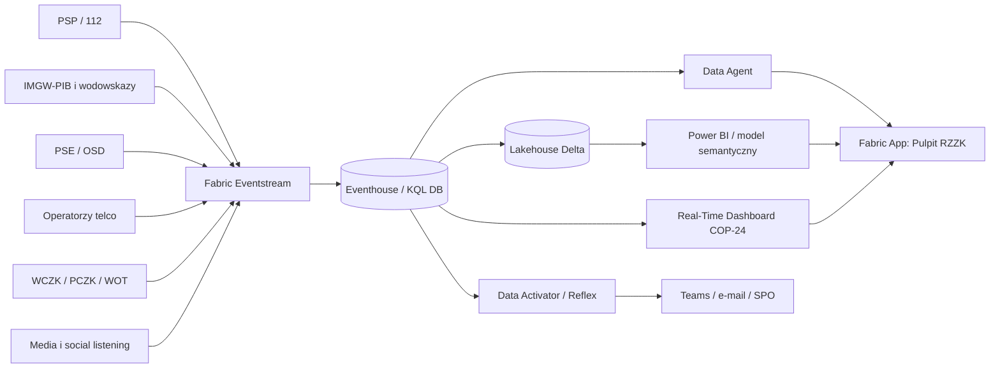

# 🌊 COP-24 — Wspólny Obraz Sytuacji

**Microsoft Fabric Real-Time Intelligence dla RCB / RZZK** — demonstrator pokazujący, jak rozproszone dane z PSP, IMGW-PIB, Wód Polskich, energetyki, telekomunikacji, WCZK/PCZK i mediów zbudować w jeden krajowy Common Operational Picture.

> ⚠️ **Disclaimer** — repozytorium jest fikcją technologiczną do celów edukacyjnych i demonstracyjnych. Wszystkie dane są w 100% syntetyczne, wygenerowane proceduralnie (`seed=42`) i nie stanowią danych operacyjnych żadnej instytucji.

## ⚖️ Kontekst prawny i biznesowy

Demo odwołuje się do logiki ustawy o zarządzaniu kryzysowym i KPZK: fazy zapobieganie, przygotowanie, reagowanie, odbudowa oraz poziomy reagowania gmina→powiat→wojewoda→minister wiodący→RZZK. Problem biznesowy jest prosty: decydent krajowy nie może czekać na ręczne sklejenie meldunków z wielu instytucji. Potrzebuje wspólnego obrazu, liczb, rekomendacji SPO i audytu decyzji.

## 🏗️ Rozwiązanie



Eventstream przyjmuje zdarzenia, Eventhouse analizuje real-time, Lakehouse przechowuje wymiary i wyniki KIS, Power BI i Real-Time Dashboard prezentują sytuację, Activator wysyła alerty, Data Agent odpowiada językiem naturalnym, a Fabric App „Pulpit RZZK” zapisuje decyzje.

## 📁 Zawartość repo

| Obszar | Pliki |
|---|---|
| Dane | `datasets/*.csv`, `datasets/*.jsonl`, `datasets/derived/*` |
| Symulacja | `generate_datasets.py`, `simulate_realtime.py` |
| KQL | `kql/01_create_tables.kql` … `05_escalation_rules.kql` |
| Notebooki | `notebooks/01_load_dimensions.py`, `02_situation_index.py`, `03_escalation_recommendation.py` |
| Dashboard | `dashboard/RTI_DASHBOARD.md` |
| Semantyka | `semantic-model/MODEL.md`, `MEASURES.md` |
| Akcja | `activator/RULES.md`, `fabric-app/*`, `ai/DATA_AGENT.md` |

## 📦 Rzeczywiste liczby rekordów

| Plik | Rekordy |
|---|---:|
| `dim_voivodeship.csv` | 16 |
| `dim_powiat.csv` | 380 |
| `dim_gmina.csv` | 2477 |
| `dim_hazard.csv` | 20 |
| `dim_institution.csv` | 422 |
| `dim_spo.csv` | 16 |
| `dim_river_gauge.csv` | 120 |
| `hydro_readings.jsonl` | 46920 |
| `weather_observations.jsonl` | 39900 |
| `incident_reports.jsonl` | 1714 |
| `power_grid_events.jsonl` | 592 |
| `telecom_events.jsonl` | 343 |
| `evacuation_status.jsonl` | 321 |
| `resource_deployment.jsonl` | 432 |
| `media_signals.jsonl` | 3044 |
| `escalation_events.jsonl` | 5 |

## 🔢 Kluczowe liczby demo

Źródło prawdy: `datasets/derived/demo_metrics.json` (generowany przez `compute_metrics.py`).
Uruchamiaj go po każdej regeneracji danych — inaczej dokumentacja rozjedzie się ze zbiorem.

- Gminy w alarmie hydro łącznie: 10.
- Szczyt zasilania: 14 168 odbiorców bez prądu w godzinie 2026-09-16T18:00, 139 539 w skali doby.
- Osoby w najnowszych statusach ewakuacji: 15 445.
- Incydenty łącznie: 1 714, w tym 495 priorytetu 1; objętych zgłoszeniami 91 612 osób.
- Minimalne pokrycie telco: 22.6%.
- Sygnały medialne: 3 044, w tym 335 dezinformacji o zasięgu 37 798 399.
- Maksymalny lokalny KIS: 86,3 w 2026-09-17 (dolnośląskie) — jedyna doba osiągająca próg zwołania RZZK.
- Rekomendacje eskalacji w całej scenie: 26 × powiat, 7 × wojewoda, 5 × minister wiodący, 1 × RZZK.

## 🚀 Uruchomienie lokalne (Windows / PowerShell)

```powershell
cd C:\repos\OchronaLudnosci\ol-cop24
python generate_datasets.py
python notebooks\02_situation_index.py
python notebooks\03_escalation_recommendation.py
python simulate_realtime.py --stream hydro_readings --from 2026-09-15T10:00:00+02:00 --to 2026-09-15T10:20:00+02:00 --speed 100000 --dry-run
```

Tryb `--dry-run` nie wymaga `azure-eventhub`. Realna wysyłka wymaga `.env` albo `config.json` z poświadczeniami Event Hub / Eventstream.

## 🧩 Mapowanie na funkcje Fabric

| Funkcja Fabric | Rola w demo |
|---|---|
| Eventstream | wejście real-time dla JSON |
| Eventhouse | szybkie KQL, dashboard, anomalie |
| Lakehouse | wymiary TERYT, KPZK, SPO i wyniki KIS |
| Notebooki | scoring, normalizacja, rekomendacje |
| Real-Time Dashboard | pulpit operacyjny |
| Power BI | raport decyzyjny i model semantyczny |
| Data Activator | reguły progowe i powiadomienia |
| Data Agent | pytania językiem naturalnym |
| Fabric Apps / Rayfin | Pulpit RZZK i write-back decyzji |

## 👤 Dla kogo jest to demo

Dla kierownictwa RCB, wojewodów, ministerstw wiodących, zespołów BI/analityki, architektów chmury i osób odpowiedzialnych za integrację danych kryzysowych. Nie jest to system dowodzenia; jest to demonstrator wartości: wspólny obraz, szybsza decyzja, lepsze uzasadnienie i audyt.

## 📚 Jak prowadzić demo

Użyj `DEMO_SCRIPT.md` jako głównego scenariusza. Zacznij od D-3 i skończ na przejściu do odbudowy. Jeżeli Fabric nie działa, użyj plików `datasets/derived` i dokumentacji jako planu B.

## 🛡️ Licencja

[MIT](LICENSE)

## 🧭 Jak czytać repozytorium jako produkt demo

To repozytorium jest przygotowane tak, aby można było prowadzić rozmowę z decydentem bez przechodzenia do kodu. `README.md` daje kontekst i szybki start, `DEMO_SCRIPT.md` jest scenariuszem wystąpienia, `SETUP_FABRIC.md` prowadzi zespół techniczny, a `fabric-app/APP_SPEC.md` i `dashboard/RTI_DASHBOARD.md` opisują doświadczenie użytkownika. KQL i notebooki są dowodem wykonalności, ale produktem w rozmowie jest ścieżka decyzyjna: od sygnału do SPO i audytu.

## 🧪 Powtarzalność i kalibracja

Dane są deterministyczne, dlatego te same liczby pojawiają się w dashboardzie, Data Agencie i narracji. Jeżeli zmienisz generator, najpierw uruchom notebooki i odśwież dokumentację liczb. W obecnej wersji scenariusz jest skalibrowany do prezentacji 15–20 minut: pierwsze minuty budują zaufanie, środkowa część pokazuje eskalację, a końcówka dowodzi, że Fabric wspiera nie tylko alarm, lecz również odbudowę i rozliczalność.

## 🔒 Zasady bezpieczeństwa demo

Nie umieszczaj connection stringów w repo. `.env`, `.venv`, `__pycache__` i `*.pyc` są ignorowane. Jeśli pokaz odbywa się na środowisku klienta, używaj tylko workspace demonstracyjnego i upewnij się, że Data Agent nie ma dostępu do prawdziwych danych organizacji. Wypowiedź otwierająca powinna zawsze zawierać disclaimer o danych syntetycznych.
